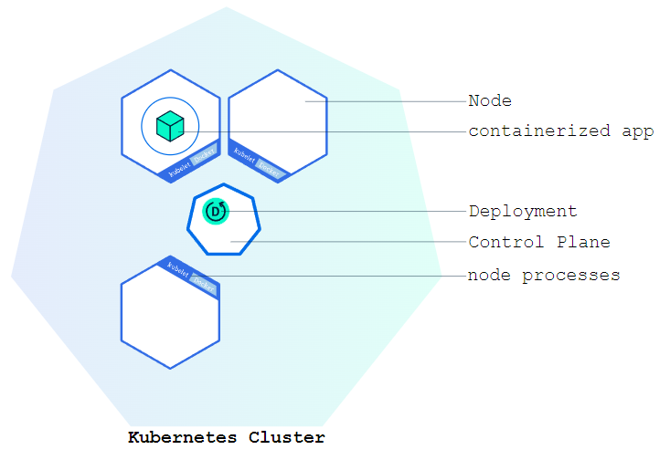

<!-- size: 16:9 -->
<!-- theme: default -->

<!-- paginate: skip -->
<!-- headingDivider: 1 -->

<style>
h1 {
  text-align: center;
  color: #005877;
}
h2 {
  color: #E87B00;
}
h3 {
  color: #005877;
}

img[alt~="center"] {
  display: block;
  margin: 0 auto;
}

</style>

# KUBERNETES - Parte 1


---

<!-- paginate: true -->

## ¿Qué es Kubernetes? (k8s)

**Kubernetes** plataforma de código abierto para automatizar la implementación, el escalado y la administración de aplicaciones en contenedores.

**Control-plane**: conjunto de componentes encargado de gestionar el clúster.

**Nodo**: máquina física o virtual en la que se ejecutan los componentes del clúster.

**Pod**: colección de contenedores que contienen una aplicación y sus dependencias:
   - Los contenedores en un Pod se ejecutan en el mismo nodo
   - Los Pods son la unidad básica de ejecución en Kubernetes

**Kubelet**: agente que se ejecuta en cada nodo para asegurar que los contenedores se ejecuten en un Pod.

**Kube-proxy**: proxy que se ejecuta en cada nodo para mantener las reglas de red.

---

## Arquitectura de Kubernetes: https://kubernetes.io/docs/concepts/architecture/ 


---

## Introducción de kind


kind (Kubernetes in Docker) es una herramienta que nos permite crear clusters de Kubernetes utilizando contenedores Docker para cada nodo.

---

## Instalación de kind

[Guía de instalación](https://kind.sigs.k8s.io/docs/user/quick-start/#installation)

Hay varias formas de instalar kind en cada Sistema Operativo, a continuación mostraremos un ejemplo en Linux, MacOs y Windows.

---

### Instalación de kind (Linux)

Según el procesador de tu máquina, descarga la versión correspondiente de kind:

```bash
# For AMD64 / x86_64
[ $(uname -m) = x86_64 ] && curl -Lo ./kind https://kind.sigs.k8s.io/dl/v0.24.0/kind-linux-amd64
# For ARM64
[ $(uname -m) = aarch64 ] && curl -Lo ./kind https://kind.sigs.k8s.io/dl/v0.24.0/kind-linux-arm64
```

```bash
chmod +x ./kind
sudo mv ./kind /usr/local/bin/kind
```

Verifica que kind se haya instalado correctamente:

```bash
kind version
```

---

### Instalación de kind (MacOS)

1. Instala Homebrew (si aún no lo has hecho):

   ```bash
   /bin/bash -c "$(curl -fsSL \
      https://raw.githubusercontent.com/Homebrew/install/HEAD/install.sh)"
   ```

2. Instala kind:

   ```bash
   brew install kind
   ```

3. Verifica que kind se haya instalado correctamente:

   ```bash
   kind version
   ```

---

### Instalación de kind (Windows)

1. Abre PowerShell como administrador.

2. Instala Chocolatey (si aún no lo has hecho):

   ```powershell
   Set-ExecutionPolicy Bypass -Scope Process -Force
   [System.Net.ServicePointManager]::SecurityProtocol = `
      [System.Net.ServicePointManager]::SecurityProtocol `
      -bor 3072 
   iex ((New-Object `
     System.Net.WebClient).DownloadString('https://chocolatey.org/install.ps1'))
   ```

3. Instala kind:

   ```powershell
   choco install kind
   ```

4. Verifica que kind se haya instalado correctamente:

   ```powershell
   kind version
   ```

---

## Creación de un cluster

```
kind create cluster
```

Esto creará un cluster llamado kind. Podemos personalizar el nombre usando el flag --name:

```
kind create cluster --name kind-2
```

---

## Exploración del cluster (I)

Mediante un listado de contenedores podemos observar que el servidor de kubernetes se ha desplegado dentro de un contenedor de docker:

   ```bash
   docker ps
   ```

**kubectl** es la interfaz de línea de comandos de Kubernetes:
   - https://kubernetes.io/docs/tasks/tools/

Utiliza la API de Kubernetes para interactuar con el clúster.

---

## Exploración del cluster (II)

1. Verifica que el cluster está en funcionamiento:

   ```bash
   kubectl cluster-info
   ```

   ```bash
   kubectl cluster-info kind-kind-2
   ```

2. Lista los nodos del cluster:

   ```bash
   kubectl get nodes
   ```

---
## Contextos de Kubernetes

En caso de tener varios clusteres:

1. Ver los contextos disponibles en tu configuración de Kubernetes:

   ```bash
    kubectl config get-contexts
   ```

2. Cambiar al contexto del cluster que deseas inspeccionar:

   ```bash
    kubectl config use-context <nombre-del-contexto>
   ```

3. Listar nodos del cluster seleccionado:

   ```bash
   kubectl get nodes
   ```
---

## Borrado del cluster

   ```bash
   kind delete cluster
   ```

   ```bash
   kind delete cluster --name=kind-2
   ```

Comprobamos que ya no existen los contenedores:

   ```bash
   docker ps
   ```

---

## Despliegue (I)

Una vez tenemos un cluster de Kubernetes en funcionamiento, podemos desplegar aplicaciones contenerizadas en él [https://kubernetes.io/docs/](https://kubernetes.io/docs/)



Cada Pod ejecuta una instancia de la aplicación. Los Pods son la unidad básica de ejecución en Kubernetes.

---

## Despliegue (II)

Un Despliegue (Deployment) permite programar la ejecución de aplicaciones contenerizadas en el cluster:
- Indica qué aplicación se va a ejecutar y cómo hacerlo
- Crea nuevos Pods si no hay suficientes
- Elimina Pods si hay demasiados
- Mantiene los Pods actualizados con la última versión de la aplicación

```bash
kubectl create deployment <nombre-del-despliegue> --image=<imagen-de-la-aplicación>
kubectl create deployment web-nginx --image=nginx:alpine
```

---

## Despliegue (III)

¿Qué ha hecho el comando anterior?:

1. Buscar un nodo donde ejecutar una instancia de la aplicación (actualmente sólo tenemos un nodo disponible)
2. Programar la ejecución de la aplicación en ese nodo
3. Configurar el cluster para reprogramar la instancia en un nuevo nodo cuando fuera necesario

Verificar despliegue:

```bash
kubectl get deployments
```

Eliminar un despliegue:

```bash
kubectl delete deployment <nombre-del-despliegue>
```

---

## Visualización de la aplicación (I)

Los Pods funcionan en una red privada y aislada.

Por defecto, son visibles desde otros Pods y servicios dentro del mismo cluster, pero no fuera de esa red.

Para acceder a la aplicación, necesitamos exponerla fuera de la red privada del cluster:

```bash
kubectl proxy
```

El proxy reenviará las comunicaciones a la red privada del cluster. Debe abrirse en otra terminal y puede detenerse presionando control-C.

---

## Visualización de la aplicación (II)

Para acceder a un Pod a través del proxy, necesitamos conocer su nombre:

```bash
kubectl get pods
```
Información del pod:
[http://localhost:8001/api/v1/namespaces/default/pods/<nombre-del-pod>](http://localhost:8001/api/v1/namespaces/default/pods/<nombre-del-pod>)

URL para acceder al pod:
[http://localhost:8001/api/v1/namespaces/default/pods/<nombre-del-pod>/proxy/](http://localhost:8001/api/v1/namespaces/default/pods/<nombre-del-pod/proxy/>)

---

## Visualización de la aplicación (III)

También podemos acceder a la aplicación redirigiendo un puerto en la máquina local a un puerto del Pod:

```bash
kubectl port-forward <nombre-del-pod> <puerto-local>:<puerto-pod>
```

---

## Visualización para PRUEBAS Y DESARROLLO... ¿Y producción?

El uso de proxies o port-forwarding es __recomendable para pruebas y desarrollo__... pero __no para aplicaciones en producción__:

- No son escalables
- No son seguros
- No permiten acceso externo

Para exponer una aplicación de manera segura y escalable, necesitamos un __servicio__.

---

## Servicios (Services) (I)

**Servicio**: abstracción que define una política de acceso a un conjunto de pods.

Proporciona una forma constante de acceder a una aplicación, independientemente de los cambios en la ubicación o el escalado de los pods.

Los servicios pueden ser expuestos internamente en el cluster o de manera externa, permitiendo la comunicación entre diferentes componentes de la aplicación.

---

## Servicios (Services) (II)

Listar servicios actuales:

```bash
kubectl get services
```

Por defecto se crea un servicio `kubernetes` para acceder a la API del cluster.

Si queremos ver en un mismo comando los servicios, los despliegues y los pods:

```bash
kubectl get pods,deployments,services
```

Para eliminar un servicio:

```bash
kubectl delete service <nombre-del-servicio>
```

---

## Servicios (Services) (III)

Para crear un nuevo servicio y exponerlo al tráfico externo, utilizaremos el comando `expose` con `NodePort` como parámetro.

```bash
kubectl expose deployment web-nginx --type=NodePort --port=80
```

Podemos ver el puerto asignado al servicio en el campo `NodePort` listando los servicios con `kubectl get services` o visualizando los detalles del servicio:

```bash
kubectl describe services/web-nginx
```

---

## Acceder a un servicio

Para acceder a un servicio, necesitamos:
   - Dirección IP del nodo
   - Puerto asignado al servicio (`kubectl get services`)

Podemos obtener la dirección IP del nodo con el comando:
   
```bash
   kubectl get nodes -o wide
```

El comando anterior nos mostrará la dirección IP del nodo en la columna `INTERNAL-IP`.

---

## Problemas para acceder

Si el puerto `NodePort` es aleatorio, no conoceremos el puerto asignado cada vez que se reinicie el cluster, se cree un nuevo servicio, se modifique el servicio, etc.

Por ello, __es recomendable asignar un puerto específico__ al servicio usando un archivo de configuración `yaml`:

- Permite versionar la configuración
- Facilita la replicación del entorno
- Evita errores humanos

---


## Servicios como IaC (I)

Kubernetes asigna un puerto aleatorio entre 30000 y 32767 para cada servicio.

```yaml
apiVersion: v1
kind: Service
metadata:
  name: service-nginx
spec:
  selector:
    app: web-nginx
  type: NodePort
  ports:
    - name: http
      port: 80
      nodePort: 30080
```

---

## Servicios como IaC (II)

```yaml
apiVersion: v1
kind: Service
metadata:
  name: service-nginx
```
* apiVersion: versión de la API de Kubernetes a utilizar
* kind: tipo de archivo de configuración (Service)
* metadata: metadatos del recurso (nombre del servicio)

---

## Servicios como IaC (III)

```yaml
spec:
  selector:
    app: web-nginx
```

* El Servicio (Service) selecciona los Pods que se expondrán en función de sus etiquetas.
* Deben coincidir con las especificadas para los Pods en el recurso de Despliegue (en nuestro caso web-nginx).

---

## Servicios como IaC (IV)

```yaml
spec:
  type: NodePort
  ports:
    - name: http
      port: 80
      nodePort: 30080
```

En este caso, el Servicio (Service) escucha las solicitudes en el puerto 80 y las reenvía al puerto 30080 de los Pods de destino.

---

### Comando para aplicar la configuración del servicio:

Recarga la configuración en el cluster:

```bash
kubectl apply -f [ruta-al-archivo]/[nombre-archivo].yaml
 ```

```bash
kubectl get services
```

---

## Tipos de servicios

Aunque hemos usado un servicio `NodePort`, existen varios tipos:

* **ClusterIP**: expone el servicio en una dirección IP interna del clúster. Este tipo de servicio sólo es accesible desde dentro del clúster.
* **NodePort**: expone el servicio en cada IP del nodo en un puerto estático (el NodePort). El servicio será accesible desde fuera del clúster haciendo una petición a <NodeIP>:<NodePort>.
* **LoadBalancer**: expone el servicio externamente mediante un balanceador de carga.

Para utilizar un servicio de tipo LoadBalancer, necesitamos un proveedor de servicios en la nube que soporte este tipo de servicio, algo que por defecto no tenemos en nuestro cluster de kind.

---

## Problemas para acceder con la dirección IP del nodo

Hemos usado la dirección IP del nodo para acceder a los servicios, pero esto no es recomendable en un entorno de producción:

- La dirección IP del nodo puede cambiar si se reinicia el cluster o si se añaden o eliminan nodos
- Falta de escalabilidad y seguridad
- Falta de abstracción (más atado a la infraestructura)
s
En __producción__, es recomendable utilizar un servicio de tipo `LoadBalancer`.

En __entornos locales o de pruebas__ como `kind`, podemos acceder a los servicios a través de `localhost`.

---

## Mapeo de puertos (I)

Usando un archivo de configuración `yaml`, podemos crear un cluster con un mapeo de puertos personalizado:

```yaml
kind: Cluster
apiVersion: kind.x-k8s.io/v1alpha4
nodes:
- role: control-plane
  extraPortMappings:
  - containerPort: 30080
    hostPort: 8080
    protocol: TCP
```

---

## Mapeo de puertos (II)

```yaml
kind: cluster
apiVersion: kind.x-k8s.io/v1alpha4
```

* Tipo de archivo de configuración (Cluster)
* Versión de la API de Kubernetes a utilizar

---

## Mapeo de puertos (III)

```yaml
nodes:
- role: control-plane
  extraPortMappings:
  - containerPort: 30080
    hostPort: 8080
    protocol: TCP
```

* Se indican los nodos que contiene el cluster
* Mapeamos el puerto de dentro del cluster (30080) al puerto 8080 de nuestro host.

---

## Mapeo de puertos (IV)

Podremos crear el nuevo cluster aplicando la configuración anterior mediante el comando:

```bash
kind create cluster --config [ruta-al-archivo]/[nombre-archivo.yaml]
```

Repetimos los pasos anteriores para desplegar la aplicación y crear el servicio.

```bash
kubectl create deployment web-nginx --image=nginx:alpine
kubectl apply -f [ruta-al-servicio]/[nombre-archivo-servicio].yaml
```

__http://localhost:8080__

---

# Ejercicio

1. Crea un cluster de kind con un mapeo de puertos personalizado que apunte al puerto 80 de tu máquina local.

2. Crea un despliegue en el cluster para ejecutar la aplicación de Apache.

3. Configura un servicio para el deployment de Apache de manera que puedas acceder a la aplicación desde tu navegador a través del puerto 80.

4. Realiza pruebas para asegurarte de que se abre la página de Apache.

5. Investiga cómo crear un despliegue mediante un archivo de configuración yaml e intenta crear el despliegue de Apache de esta manera.
