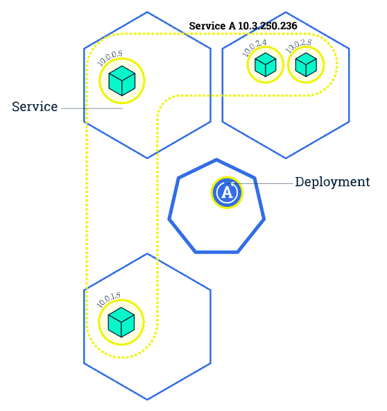

<!-- size: 16:9 -->
<!-- theme: default -->

<!-- paginate: skip -->
<!-- headingDivider: 1 -->

<style>
h1 {
  text-align: center;
  color: #005877;
}
h2 {
  color: #E87B00;
}
h3 {
  color: #005877;
}

img[alt~="center"] {
  display: block;
  margin: 0 auto;
}
</style>

# KUBERNETES - Parte 2


---

<!-- paginate: true -->

## Recordatorio...


---

## Recordatorio...

`kind create cluster` Crear cluster local

`kubectl get nodes` Lista los nodos del cluster

`kind delete cluster` Borrado del cluster

Crear un despliegue de nginx en un cluster: 
`kubectl create deployment web-nginx --image=nginx:alpine`

Listado de despliegues, pods y servicios:
`kubectl get deployments,pods,services`

---

## Recordatorio...

Un servicio proporciona una forma constante de acceder a una aplicación.

Crear servicio para despliegue de nginx:
`kubectl expose deployment web-nginx --type=NodePort --port=80`

Podemos ver el puerto asignado al servicio en el campo NodePort mediante:
  * `kubectl describe services/web-nginx` (Información del servicio)
  * `kubectl get services` (Listado de servicios del cluster)

Para asignar puerto específico, usar archivo de configuración.

---

## Recordatorio...

```yaml
apiVersion: v1
kind: Service
metadata:
  name: service-nginx
spec:
  type: NodePort
  ports:
    - name: http
      port: 80
      nodePort: 30080
  selector:
    app: web-nginx
```

---

## Recordatorio...

Usando un archivo de configuración, podemos crear un cluster con un mapeo de puertos personalizado:

```yaml
kind: cluster
apiVersion: kind.x-k8s.io/v1alpha4
nodes:
- role: control-plane
  extraPortMappings:
  - containerPort: 30080
    hostPort: 8080
    protocol: TCP
```

---

## Recordatorio...

Podremos crear el nuevo cluster aplicando la configuración anterior mediante el comando:

```bash
kind create cluster --config [ruta-al-archivo]/[nombre-archivo.yaml]
```

Repetimos los pasos anteriores para desplegar la aplicación y crear el servicio.

```bash
kubectl create deployment web-nginx --image=nginx:alpine
kubectl apply -f [ruta-al-archivo]/[nombre-archivo].yaml
```

---

## Despliegue de una aplicación con IaC

Anteriormente hemos visto cómo crear clusters y servicios usando archivos de configuración `yaml`.

Podemos hacer lo mismo con los despliegues de aplicaciones. Ventajas:

* Definir el estado de la aplicación y facilidad de reproducibilidad
* Versionado y almacenado en un repositorio
* Uso compartido entre usuarios y equipos
* Automatización de la creación de aplicaciones
* Escalabilidad más flexible mediante lenguaje declarativo

---

## Archivo de despliegue (I)

   ```yaml
   apiVersion: apps/v1
   kind: Deployment
   metadata:
     name: nginx-deployment
   spec:
     selector:
       matchLabels:
         app: web-nginx
     template:
       metadata:
         labels:
           app: web-nginx
       spec:
         containers:
         - name: nginx
           image: nginx:mainline-alpine
            ports:
              - containerPort: 80
   ```
---

## Archivo de despliegue (II)

```yaml
   apiVersion: apps/v1
   kind: Deployment
   metadata:
     name: nginx-deployment
   ```

* __kind__: tipo de recurso (Deployment)
* __apiVersion__: versión de este tipo de recurso (apps/v1)
* __metadata.name__: recurso específico (web-nginx)

---

## Archivo de despliegue (III)

```yaml
   spec:
     selector:
       matchLabels:
         app: web-nginx
     template:
       metadata:
         labels:
           app: web-nginx
```

* __selector.matchLabels__: selecciona aquellos Pods con una etiqueta (app:web-nginx) para que pertenezcan a este Deployment
* __template.metadata.labels__: etiqueta (app:web-nginx) para los Pods que envuelven tu contenedor

---

## Archivo de despliegue (IV)

```yaml
     template:
       spec:
         containers:
         - name: nginx
            image: nginx:mainline-alpine
            ports:
              - containerPort: 80
   ```

* Un nombre para el contenedor (nginx)
* El nombre de la imagen Docker a usar (nginx:mainline-alpine)
* Puerto en el que exponemos el contenedor (80)

---

## Archivo de despliegue (V)

Despliega la aplicación en el cluster:

```bash
kubectl apply -f [ruta-al-archivo]/nginx.yaml
```

Si creamos un servicio y usamos un mapeo de puertos para la configuración del cluster, podremos acceder a la aplicación en localhost.

```bash
kind create cluster --config [ruta-archivo-configuracion-cluster.yaml]
kubectl apply -f [ruta-directorio-archivos-yaml]
kubectl get deploy,svc,pod
```

[http://localhost:<Puerto_mapeado>](http://localhost:<Puerto_mapeado>)

---

## Archivo de despliegue (VI)

Se puede usar el símbolo `---` para separar diferentes tipos de recursos (deployment, service...) en un solo archivo de configuración...

   ```yaml
   kind: Deployment
   ...
   ---
   kind: Service
   ...
   ```

... aunque es recomendable mantenerlos en archivos separados para facilitar la lectura.

---

## Escalado de la aplicación (I)

Escalar un Despliegue garantizará que se creen nuevos Pods y se programen en Nodos con recursos disponibles.
La escalabilidad se logra cambiando el número de réplicas en un Despliegue.



---

## Escalado de la aplicación (II)

Comprobamos el número de pods y despliegues:

```bash
kubectl get deploy,svc,pod
```

Escala el deployment para tener 2 réplicas:

```bash
kubectl scale deployment nginx-deployment --replicas=2
```

Si volvemos a comprobar el número de pods y despliegues, veremos que ahora tenemos dos en vez de uno.

---

## Escalado de la aplicación (III)

Podemos escalar un deployment desde un archivo de configuración:

```yaml
   apiVersion: apps/v1
   kind: Deployment
   metadata:
     name: nginx-deployment
   spec:
     replicas: 4
     ...
```
  
```bash
  kubectl apply -f [ruta-directorio-archivos-yaml]
```

- Al borrar uno de los pods, se creará otro para mantener el número de réplicas

- En producción, esto proporcionará __alta disponibilidad__ de la aplicación

---

## Varias aplicaciones

Hasta ahora, sólo hemos desplegado una aplicación en el cluster:

- Lo más probable es que en un sistema real necesitemos desplegar varias aplicaciones: backend, base de datos, etc.
- Vamos a desplegar una aplicación __Wordpress__, necesitaremos:
  - Configuración del cluster
  - Despliegue Wordpress
  - Servicio Wordpress
  - Despliegue MariaDB
  - Servicio MariaDB

---

## Varias aplicaciones (Configuración del cluster)

```yaml
kind: Cluster
apiVersion: kind.x-k8s.io/v1alpha4
nodes:
- role: control-plane
  extraPortMappings:
  - containerPort: 30001
    hostPort: 8081
    protocol: TCP
```

---

## Varias aplicaciones (Despliegue de Wordpress I)

```yaml
apiVersion: apps/v1
kind: Deployment
metadata:
  name: wordpress
spec:
  selector:
    matchLabels:
      app: wordpress
  template:
    metadata:
      labels:
        app: wordpress
    spec:
      containers:
        - name: wordpress
          image: bitnami/wordpress:latest
          ports:
            - containerPort: 8080
```

---

## Varias aplicaciones (Despliegue de Wordpress II)

```yaml
    spec:
      containers:
        ...
          env:
            - name: ALLOW_EMPTY_PASSWORD
              value: 'yes'
            - name: WORDPRESS_DATABASE_USER
              value: 'bn_wordpress'
            - name: WORDPRESS_DATABASE_NAME
              value: 'bitnami_wordpress'
            - name: WORDPRESS_DATABASE_HOST
              value: 'service-mariadb' # Nombre del servicio de MariaDB
```

* __env__: variables de entorno que se usarán en el contenedor.
* Estas variables están definidas en la imagen de Docker que vamos a usar: [https://hub.docker.com/r/bitnami/wordpress](https://hub.docker.com/r/bitnami/wordpress)

---

## Varias aplicaciones (Servicio de WordPress)

```yaml
apiVersion: v1
kind: Service
metadata:
  name: service-wp
spec:
  type: NodePort
  selector:
    app: wordpress
  ports:
    - name: http
      port: 8080 # Puerto por defecto de Wordpress
      nodePort: 30001
```
---

## Varias aplicaciones (Despliegue de MariaDB I)

```yaml
apiVersion: apps/v1
kind: Deployment
metadata:
  name: mariadb
spec:
  selector:
    matchLabels:
      app: mariadb
  template:
    metadata:
      labels:
        app: mariadb
    spec:
      containers:
        - name: mariadb
          image: bitnami/mariadb:latest
          ports:
            - containerPort: 3306
```
---

## Varias aplicaciones (Despliegue de MariaDB II)

```yaml
    spec:
      containers:
        ...
          env:
            - name: ALLOW_EMPTY_PASSWORD
              value: 'yes'
            - name: MARIADB_USER
              value: 'bn_wordpress'
            - name: MARIADB_DATABASE
              value: 'bitnami_wordpress'
```

* Estas variables están definidas en la imagen de Docker que vamos a usar: [https://hub.docker.com/r/bitnami/mariadb](https://hub.docker.com/r/bitnami/mariadb)

---

## Varias aplicaciones (Servicio de MariaDB)

```yaml
apiVersion: v1
kind: Service
metadata:
  name: service-mariadb
spec:
  type: ClusterIP
  selector:
    app: mariadb
  ports:
    - name: http
      port: 3306
      targetPort: 3306
```

* El tipo de servicio ClusterIP sólo es accesible desde dentro del clúster
* __Enfoque adecuado si no necesitas exponer el servicio públicamente__

---

## Varias aplicaciones

```bash
kind create cluster --config [ruta-al-archivo]/cluster-config-wp.yaml
kubectl apply -f [ruta-directorio-archivos-yaml]
```

Veamos nuestros servicios, despliegues y pods:

```bash
kubectl get svc,deploy,pod
```

En [http://localhost:8081](http://localhost:8081) veremos que tenemos Wordpress funcionando.

---

## Volúmenes persistentes

Si queremos desplegar una aplicación que requiera almacenamiento persistente, necesitaremos usar volúmenes persistentes:
  * Los volúmenes son directorios que se montan en los contenedores de los Pods
  * Los volúmenes se pueden usar para almacenar datos que deben sobrevivir a la vida del Pod

Si probamos a borrar el Pod de MariaDB, veremos que se crea uno nuevo, pero la aplicación no funciona o se habrá perdido la información:

```bash
kubectl delete pod mariadb-<id-pod>
```

---

## Volúmenes persistentes (Crear volumen persistente)

```yaml
apiVersion: v1
kind: PersistentVolumeClaim
metadata:
  name: mariadb-pvc
spec:
  accessModes:
    - ReadWriteOnce
  resources:
    requests:
      storage: 256Mi
```
* __PersistentVolumeClaim__: recurso de tipo volumen persistente
* __metadata.name__: nombre del volumen persistente
* __spec.accessModes__: modos de acceso al volumen
* __spec.resources.requests.storage__: tamaño del volumen

---

## Volúmenes persistentes (Modificación de MariaDB)

```yaml
...
spec:
...
    spec:
      containers:
        - name: mariadb
          image: bitnami/mariadb:latest
          ...
          volumeMounts:
            - name: mariadb-persistent-storage
              mountPath: /bitnami/mariadb
```
* __spec.containers.volumeMounts.name__: nombre del volumen
* __spec.containers.volumeMounts.mountPath__: directorio en el que se montará el volumen dentro del contenedor

---

## Volúmenes persistentes (Modificación de MariaDB)

```yaml
    spec:
      containers: ...
          volumeMounts: ...
      volumes:
        - name: mariadb-persistent-storage
          persistentVolumeClaim:
            claimName: mariadb-pvc
```
* __spec.volumes.name__: nombre del volumen
* __spec.volumes.persistentVolumeClaim.claimName__: nombre que se utilizará para solicitar un volumen persistente del cluster de Kubernetes

- Ahora podemos hacer la prueba de borrar el pod de MariaDB y ver que la aplicación sigue funcionando...

- ...Pero para asegurarnos de que los datos de Wordpress no se pierdan, necesitamos hacer lo mismo para Wordpress.

---

## initContainers

Los initContainers son contenedores que se ejecutan antes de que se inicie el contenedor principal.

Podemos usar initContainers para copiar archivos de configuración, descargar archivos, etc.

---

## initContainers (Ejemplo)

```yaml
apiVersion: apps/v1
kind: Deployment
metadata:
  name: nginx-deployment
spec:
  selector:
    matchLabels:
      app: nginx
  template:
    metadata:
      labels:
        app: nginx
    spec:
      initContainers:
        - name: init-permissions
          image: busybox
          command: ["sh", "-c", "mkdir -p /usr/share/nginx/html && echo \"Hello World!\" > /usr/share/nginx/html/index.html"]
          volumeMounts:
            - name: nginx-content
              mountPath: /usr/share/nginx/html
      containers:
        - name: nginx
          image: nginx:latest
          ports:
            - containerPort: 80
          volumeMounts:
            - name: nginx-content
              mountPath: /usr/share/nginx/html
      volumes:
        - name: nginx-content
          persistentVolumeClaim:
            claimName: nginx-content-pvc
```
---

## initContainers (Ejemplo)

```yaml
...
      initContainers:
        - name: init-permissions
          image: busybox
          command: ["sh", "-c", "mkdir -p /usr/share/nginx/html && echo "Hello, World!" > /usr/share/nginx/html/index.html"]
          volumeMounts:
            - name: nginx-content
              mountPath: /usr/share/nginx/html
...
```

* __initContainers__: sección que contiene la lista de contenedores que se ejecutarán antes de que se inicie el contenedor principal
* __initContainers.name__: nombre del contenedor
* __initContainers.image__: imagen del contenedor (busybox es una imagen ligera de Linux, puede ser cualquiera)
* __initContainers.command__: comando que se ejecutará en el contenedor
* __initContainers.volumeMounts__: montaje de volúmenes en el contenedor