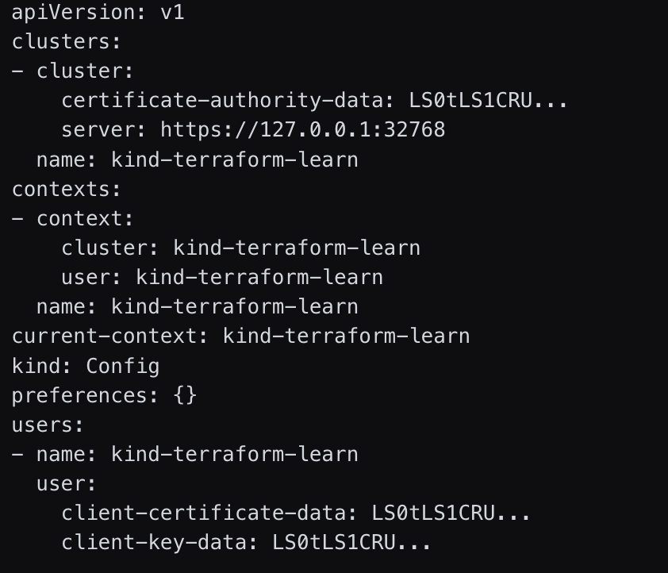

<!-- size: 16:9 -->
<!-- theme: default -->

<!-- paginate: false -->
<!-- headingDivider: 1 -->

<style>
h1 {
  text-align: center;
  color: #005877;
}
h2 {
  color: #E87B00;
}
h3 {
  color: #005877;
}
p.foot {
  font-size: 90%;
  color: #555;
}
code {
  font-size: 95%;
}
img[alt~="center"] {
  display: block;
  margin: 0 auto;
}
</style>

# KUBERNETES CON TERRAFORM


---

## ¿Qué es Terraform?

- Herramienta **IaC** (Infraestructura como Código) declarativa.
- **Providers** para hablar con APIs (Docker, Kubernetes, cloud, etc.).
- Ciclo: `terraform init` → `plan` → `apply` → `destroy`.
- Estado: mantiene un **state** para saber qué existe y qué hay que cambiar.

**Objetivo:** usar Terraform para describir y desplegar recursos de Kubernetes (Deployments, Services, PVCs) y verificar con `kubectl`.

---

## Requisitos (local con kind)

- **Docker** y **kind** con un clúster creado (contexto `kind-kind`, por defecto).
- **kubectl** apuntando al contexto correcto.
- **Terraform** instalado.

Comprobaciones:
```bash
kind --version
kubectl config get-contexts
terraform -version
```

---

## Ventajas de usar Terraform con Kubernetes

- **Plan** antes de aplicar: ves qué va a cambiar (terraform plan) y evitas sorpresas.
- **Detecta y corrige diferencias** entre lo que declaras y lo que hay en el clúster.
- **Reutilizable y parametrizable**: módulos y variables para repetir el mismo patrón en varios entornos.
- **CI/CD**: misma herramienta y formato para crear y actualizar todos los recursos.

https://developer.hashicorp.com/terraform/tutorials/kubernetes/kubernetes-provider?variants=kubernetes%3Akind

---

## Estructura del proyecto (sugerida)

```
k8s-terraform/
├── main.tf            # provider y ajustes comunes
├── nginx.tf           # ejemplo NGINX base
├── nginx-vars.tf      # NGINX con variables
├── mariadb.tf         # Deployment + Service
├── wordpress.tf       # Deployment + Service
├── storage.tf         # PVCs (dinámicos con StorageClass)
└── outputs.tf         # (opcional) valores de salida
```

> Terraform **lee todos los `.tf`** del directorio y compone un único plan.

---

## Provider Kubernetes (I)

Al igual que con otros providers, necesitamos definir el provider Kubernetes en un archivo `.tf`.

```hcl
terraform {
  required_providers {
    kubernetes = {
      source  = "hashicorp/kubernetes"
      version = "~> 2.30" # Opcional
    }
  }
}
```

---

## Provider Kubernetes (II)

Como usaremos un clúster local con **kind**, tenemos varias opciones para la configuración del provider. Aquí mostramos dos formas:
  - La configuración del clúster (lee `KUBECONFIG` o `~/.kube/config`)
  - Uso de variables para definir el acceso explícitamente.

---

## Provider Kubernetes (Kubeconfig) - Estructura

```
ejemplo-terraform/
├── cluster-config/          
│   └── cluster-config.yaml  # Fichero kind con mappings de puertos
├── main.tf                  # provider y ajustes comunes
└── nginx.tf                 # ejemplo NGINX (Deployment + Service)
```

> Terraform **lee todos los `.tf`** del directorio y compone un único plan.

---

## Provider Kubernetes (Kubeconfig) - *cluster-config.yaml*

```yaml
kind: Cluster
apiVersion: kind.x-k8s.io/v1alpha4
nodes:
- role: control-plane
  extraPortMappings:
  - containerPort: 30201
    hostPort: 8080
```

---

## Provider Kubernetes (Kubeconfig)

```hcl
provider "kubernetes" {
  config_path    = "~/.kube/config"
  config_context = "kind-kind"
}
```

> Esta es la forma más sencilla si tienes `kubectl` funcionando correctamente.

- `config_path`: ruta al fichero kubeconfig.
- `config_context`: contexto del clúster.

---

## Provider Kubernetes (Kubeconfig) - *main.tf*

Para montar un NGINX básico, necesitamos inicializar Terraform para descargar el provider:

```hcl
terraform {
  required_providers {
    kubernetes = {
      source  = "hashicorp/kubernetes"
      version = "~> 2.30" # Opcional
    }
  }
}

provider "kubernetes" {
  config_path    = "~/.kube/config"
  config_context = "kind-kind"
}
```

```bash
terraform init
```

---

## NGINX básico — *nginx.tf* (Deployment)

Sintaxis similar a la de los ficheros YAML de Kubernetes.

```hcl
resource "kubernetes_deployment" "nginx" {
  metadata { name = "web-nginx" labels = { app = "web" } }
  spec {
    replicas = 2
    selector { match_labels = { app = "web" } }
    template {
      metadata { labels = { app = "web" } }
      spec {
        container {
          name  = "nginx"
          image = "nginx:stable"
          port  { container_port = 80 }
        }
      }
    }
  }
}
```

---

## NGINX básico — *nginx.tf* (Service)

```hcl
resource "kubernetes_service" "nginx" {
  metadata {
    name   = "web-nginx"
    labels = { app = "web" }
  }
  spec {
    selector = { app = "web" }
    port {
      node_port = 30201
      port        = 80
      target_port = 80
    }
    type = "NodePort"
  }
}
```

---

## Verificación (NGINX)

```bash
terraform apply
kubectl get deploy,svc
```

> En macOS/Windows con kind, **NodePort** no expone en `localhost` por defecto.
Opciones:
- Crear el clúster con `extraPortMappings` (host:8080 → node:30201), **o**
- `kubectl port-forward svc/web-nginx 8080:80` → http://localhost:8080

---

## Provider Kubernetes (Variables de acceso I)

Además del método con kubeconfig, podemos definir las variables de acceso directamente en el provider:

```hcl
provider "kubernetes" {
  host = var.host
  client_certificate     = base64decode(var.client_certificate)
  client_key             = base64decode(var.client_key)
  cluster_ca_certificate = base64decode(var.cluster_ca_certificate)
}
```
> Útil para entornos CI/CD o cuando no tienes kubeconfig.

---

## Provider Kubernetes (Variables de acceso II)

La información de acceso se puede obtener con:

```bash
kubectl config view --minify --flatten --context=kind-kind
```



- **host** → *clusters.cluster.server*
- **client_certificate** → *users.user.client-certificate*
- **client_key** → *users.user.client-key*
- **cluster_ca_certificate** → *clusters.cluster.certificate-authority-data*

---

## Provider Kubernetes (Variables de acceso) - Estructura

```
ejemplo-terraform/
├── cluster-config/          
│   └── cluster-config.yaml  # Fichero kind con mappings de puertos
├── main.tf                  # provider y ajustes comunes
├── nginx.tf                 # ejemplo NGINX (Deployment + Service)
└── terraform.tfvars         # Variables de acceso al clúster
```

> Terraform **lee todos los `.tf`** del directorio y compone un único plan.

---

## Provider Kubernetes (Variables de acceso) - *main.tf*

```hcl
terraform {
  required_providers {...

variable "host" {
  type = string
}

variable "client_certificate" {
  type = string
}

variable "client_key" {
  type = string
}

variable "cluster_ca_certificate" {
  type = string
}

provider "kubernetes" {
  host = var.host
  client_certificate     = base64decode(var.client_certificate)
  client_key             = base64decode(var.client_key)
  cluster_ca_certificate = base64decode(var.cluster_ca_certificate)
}
```

---

## Provider Kubernetes (Variables de acceso) - *terraform.tfvars*

```hcl
host                   = "https://127.0.0.1:32768"
client_certificate     = "LS0tLS1CRUdJTiB..."
client_key             = "LS0tLS1CRUdJTiB..."
cluster_ca_certificate = "LS0tLS1CRUdJTiB..."
```

- El fichero *terraform.tfvars* es leído automáticamente por Terraform para asignar valores a las variables definidas en los archivos `.tf`.

Podemos usar el mismo NGINX básico de antes en `nginx.tf` y desplegarlo con `terraform apply`.

---

## Varias aplicaciones en el clúster

Vamos a desplegar una aplicación más compleja: **WordPress + MariaDB**

```
ejemplo-terraform/
├── cluster-config/          
│   └── cluster-config.yaml  # Fichero kind con mappings de puertos
├── main.tf                  # provider y ajustes comunes (kubeconfig o variables)
├── mariadb.tf               # MariaDB Deployment + Service
└── wordpress.tf             # WordPress Deployment + Service
```

> Terraform **lee todos los `.tf`** del directorio y compone un único plan.

---

## WordPress + MariaDB — *wordpress.tf* (Deployment)

```hcl
resource "kubernetes_deployment" "wordpress" {
    metadata {
    name = "wordpress"
    labels = {
      app = "wordpress"
    }
  }
  spec {
    replicas = 1
    selector {
      match_labels = {
        app = "wordpress"
      }
    }
    template {
      metadata {
        labels = {
          app = "wordpress"
        }
      }
      spec {
        container {
          name  = "wordpress"
          image = "bitnami/wordpress:latest"
          port {
            container_port = 8080
          }
          env {
            name  = "ALLOW_EMPTY_PASSWORD"
            value = "yes"
          }
          env {
            name  = "WORDPRESS_DATABASE_USER"
            value = "bn_wordpress"
          }
          env {
            name  = "WORDPRESS_DATABASE_NAME"
            value = "bitnami_wordpress"
          }
          env {
            name  = "WORDPRESS_DATABASE_HOST"
            value = "service-mariadb"
          }
        }
      }
    }
  }
}
```

---

## WordPress + MariaDB — *wordpress.tf* (Service)

```hcl
resource "kubernetes_service" "service_wp" {
  metadata {
    name = "service-wp"
    labels = {
      app = "wordpress"
    }
  }

  spec {
    selector = {
      app = "wordpress"
    }
    type = "NodePort"
    port {
      name        = "http"
      port        = 8080
      target_port = 8080
      node_port   = 30001
    }
  }
}
```

---

## WordPress + MariaDB — *mariadb.tf* (Deployment)

```hcl
resource "kubernetes_deployment" "mariadb" {
  metadata {
    name = "mariadb"
    labels = {
      app = "mariadb"
    }
  }

  spec {
    selector {
      match_labels = {
        app = "mariadb"
      }
    }
    template {
      metadata {
        labels = {
          app = "mariadb"
        }
      }
      spec {
        container {
          name  = "mariadb"
          image = "bitnami/mariadb:latest"
          port {
            container_port = 3306
          }
          env {
            name  = "ALLOW_EMPTY_PASSWORD"
            value = "yes"
          }
          env {
            name  = "MARIADB_USER"
            value = "bn_wordpress"
          }
          env {
            name  = "MARIADB_DATABASE"
            value = "bitnami_wordpress"
          }
        }
      }
    }
  }
}
```

---

## WordPress + MariaDB — *mariadb.tf* (Service)

```hcl
resource "kubernetes_service" "service_mariadb" {
  metadata {
    name = "service-mariadb"
    labels = {
      app = "mariadb"
    }
  }

  spec {
    selector = {
      app = "mariadb"
    }
    type = "ClusterIP"
    port {
      name        = "mysql"
      port        = 3306
      target_port = 3306
    }
  }
}
```

---

## Verificación (WordPress + MariaDB)

```bash
kind create cluster --config=cluster-config/cluster-config.yaml
terraform init
terraform apply
kubectl get deploy,svc,pod
```

Acceso con `NodePort` y `extraPortMappings` en kind → http://localhost:8080

---

## Persistencia con PVCs (dinámica)

> En la versión actual de **kind** existe `StorageClass` por defecto (`standard`) → **PVC crea PV automáticamente**.

Añadimos a la estructura anterior un nuevo archivo `storage.tf`:

```
ejemplo-terraform/
├── cluster-config/          
│   └── cluster-config.yaml  # Fichero kind con mappings de puertos
├── main.tf                  # provider y ajustes comunes (kubeconfig o variables)
├── mariadb.tf               # MariaDB Deployment + Service
└── wordpress.tf             # WordPress Deployment + Service
└── storage.tf               # Persistent Volume Claims
```

---

## PVCs dinámicos — *storage.tf*

```hcl
resource "kubernetes_persistent_volume_claim" "wp_pvc" {
  metadata { name = "wp-pvc" }
  spec {
    access_modes = ["ReadWriteOnce"]
    resources {
      requests = {
        storage = "2Gi"
      }
    }
    storage_class_name = "standard"
  }
}

resource "kubernetes_persistent_volume_claim" "mariadb_pvc" {
  metadata { name = "mariadb-pvc" }
  spec {
    access_modes = ["ReadWriteOnce"]
    resources {
      requests = {
        storage = "2Gi"
      }
    }
    storage_class_name = "standard"
  }
}
```

---

## Montaje de volúmenes — *wordpress.tf* (añadir)

```hcl
# Dentro de container { ... }:
volume_mount {
  name       = "wordpress-storage"
  mount_path = "/bitnami/wordpress"
}

# Dentro de spec.template.spec { ... }:
volume {
  name = "wordpress-storage"
  persistent_volume_claim {
    claim_name = "wp-pvc"
  }
}
```

> La imagen **bitnami/wordpress** usa `/bitnami/wordpress` para datos persistentes.

---

## Montaje de volúmenes — *mariadb.tf* (añadir)

```hcl
# Dentro de container { ... }:
volume_mount {
  name       = "mariadb-storage"
  mount_path = "/bitnami/mariadb"
}

# Dentro de spec.template.spec { ... }:
volume {
  name = "mariadb-storage"
  persistent_volume_claim {
    claim_name = "mariadb-pvc"
  }
}
```

> La imagen **bitnami/mariadb** persiste en `/bitnami/mariadb`.

---

## Verificación (WordPress + MariaDB con PVCs)

```bash
kind create cluster --config=cluster-config/cluster-config.yaml
terraform init
terraform apply
kubectl get deploy,svc,pod,pvc,pv
```

Acceso con `NodePort` y `extraPortMappings` en kind → http://localhost:8080

---

## Limpieza y datos

- `terraform destroy` eliminará **recursos gestionados por Terraform** (incluidos PVCs si los crea Terraform).
- Si quieres **conservar datos**, crea PVCs **fuera** de Terraform (`kubectl apply`) y solo **referéncialos** desde Terraform.

---

## Extra: Pods sin Deployment

¿Cuándo tiene sentido un Pod “a mano”?

- Debug/diagnóstico rápido (curl, psql, mysql)
- Pruebas puntuales de conectividad/configuración
- Herramientas efímeras de administración (entrar, mirar, borrar)

**No recomendable para producción** (los Pods sueltos no se re-crean si mueren).

Un Pod suelto es perfecto para pruebas y debugging. Para apps de verdad: Deployment.

---

## Extra: Pod phpMyadmin - *phpmyadmin.tf* (Pod)

```hcl
resource "kubernetes_pod_v1" "phpmyadmin" {
  metadata {
    name = "phpmyadmin-pod"
    labels = { app = "phpmyadmin" }
  }
  spec {
    container {
      name  = "phpmyadmin"
      image = "phpmyadmin:5-apache"
      port { container_port = 80 }
      env { 
        name = "PMA_HOST"
        value = "service-mariadb" 
      }
      env {
        name = "PMA_PORT"
        value = "3306"
      }
      env {
        name = "PMA_USER"
        value = "bn_wordpress"
      }
    }
  }
}
```

---

## Extra: Pod phpMyadmin - *phpmyadmin.tf* (Service)


```hcl
resource "kubernetes_service" "phpmyadmin" {
  metadata { name = "service-phpmyadmin" }
  spec {
    selector = { app = "phpmyadmin" }
    type     = "NodePort"
    port {
      name        = "http"
      port        = 80
      target_port = 80
      node_port   = 30002
    }
  }
}
```

Podemos verificarlo con:

```bash
kubectl get pod,svc
kubectl port-forward pod/phpmyadmin-pod 8081:80
```

# Ejercicio

Ejercicio: Matomo + MariaDB en Kubernetes (con Terraform).

Objetivo: Desplegar Matomo conectado a MariaDB en un clúster kind, con acceso desde el host y datos persistentes.

Se debe acceder a Matomo mediante → http://localhost:8082